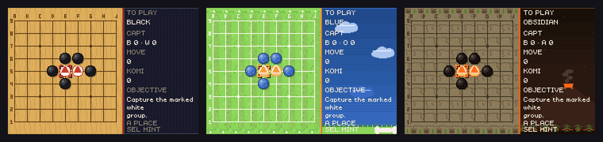
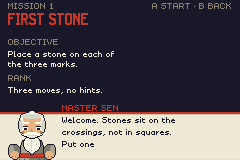
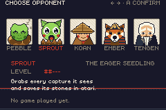

# MOKU — Tactics of Go

A Go game for the Game Boy Advance. Twenty missions teach the rules one idea at a time, then a
sandbox hands you the board against five opponents. Boards from 7×7 to 19×19, English and French,
three skins, saves in battery-backed SRAM.



The ROM is `dist/moku.gba`, 617 KB. There is a 67-second trailer at
[`dist/moku-trailer.mp4`](dist/moku-trailer.mp4).

## Playing it

```sh
mgba dist/moku.gba
```

| | on the board | in a menu |
|---|---|---|
| D-pad | move the cursor, which wraps and repeats when held | move the selection |
| A | place a stone: once to preview, again to commit | choose |
| B | take back your move and the reply | go back |
| SELECT | ask for a hint | erase a save file |
| L | cycle the panel: info, move list, score estimate | |
| R | pass | |
| START | pause menu | |
| L+R+SELECT | debug overlay: playouts, playouts/second, CPU, worst stall | |

The pause menu has resume, undo, hint, pass, score estimate, resign, options and quit. Options holds
the language, the helper, the skin, the effects, single-press placing and the two volumes, and
everything there is saved. A sandbox game you leave unfinished is saved too, and the sandbox screen
offers to resume it.

## The campaign

Twenty missions on boards that grow 7 → 9 → 13 → 19: placing stones, liberties, capture, escaping
atari, connection, the ladder, capturing a group, the net, the ko rule, one eye, two eyes, the
false eye, the snapback, seki, counting a whole game, cutting, living in a corner, five chained
life-and-death problems, and two full games.



Every position is written as an ASCII diagram and checked by a separate Go engine before it is
compiled in (`tools/gen_missions.py`). The checks are specific to each position. The ladder has to
fail from the wrong side. The net point has to be the only move on the board that traps the stone.
Exactly one move has to produce the seki. A position that stops passing its check stops the build.

Missions rank S to C on the number of moves you used, and award stars for clearing with no hint and
no undo. SELECT gives a hint whenever you want one, and after two failures the helper offers one.

## The opponents



| | | plays |
|---|---|---|
| PEBBLE | the sleepy turtle | at random, but never fills its own eyes |
| SPROUT | the eager seedling | takes every capture it can see |
| KOAN | the wandering monk | weighs territory, liberties, shape and ladders one move ahead |
| EMBER | the fox general | searches two plies over that evaluation |
| TENGEN | the old master | searches four, and reads the ladder on every weak group |

Over fifty games each on 9×9, every level beats the one below it: 86%, 100%, 100%, 100%.

They talk as well. Each opponent has a line for its first move, for taking a stone, for losing one,
for an atari, and for how the game ended, in both languages and in every skin.

## Skins and helpers

CLASSIC is wood and slate, and deliberately plain: the atari banner and nothing else. PUP is a
backyard lawn with blue and orange pebbles, confetti and a bark. DINO is a cracked stone slab with
obsidian and amber eggs, egg-shard particles, a lava flash and a volcano on the panel. The two
playful skins add banners, screen shake, particle bursts and the helper popping in with a line.
Options can turn all of that off. The layout is identical in all three.

Master Sen, INDI the blue pup and REX the small green dinosaur narrate the same tutor lines in their
own voice. Every screen exists in English and French. The fonts carry the accents, and a test
measures each string against the real font tables to check it fits the box it is drawn in.

## Building it

devkitARM and Butano are the only dependencies.

```sh
export DEVKITPRO=/opt/devkitpro DEVKITARM=$DEVKITPRO/devkitARM
export PATH=$DEVKITPRO/tools/bin:$DEVKITARM/bin:$PATH
make -j2 && make dist          # writes dist/moku.gba and build/moku.sym
```

Butano is expected next to this repository (`../butano/butano`); set `LIBBUTANO` if it lives
somewhere else. `make dist` also checks that IWRAM still has room for the stacks, which
`DECISIONS.md` explains.

The fonts, the art, the music, the AI's shape table and the campaign positions are all generated:

```sh
python3 tools/gen_font.py        # two pixel fonts, with the accents French needs
python3 tools/gen_art.py         # board, stones and markers for the three skins
python3 tools/gen_chars.py       # helpers, opponents, backgrounds, banners, stamps
python3 tools/gen_audio.py       # seven chiptunes and eighteen effects, synthesised with numpy
python3 tools/gen_patterns.py    # the 3x3 shape table the AI reads
python3 tools/gen_missions.py    # the campaign positions, and the checks on them
```

The first four take `--check` and exit non-zero if the committed output is stale;
`gen_missions.py` takes `--check-only`, which re-runs every proof without writing anything.

## Testing it

The rules engine, the AI, the campaign and the whole board-screen state machine are ordinary C++
with no Butano in them, so they are tested on the host without a ROM:

```sh
cmake -S tests/host -B build-host -G Ninja -DCMAKE_BUILD_TYPE=Release
cmake --build build-host -j2 && ctest --test-dir build-host
```

That is eight suites and 103 829 assertions. `tool_arena` plays the levels against each other,
`tool_bench` measures the engine, and `tool_difftest | python3 tools/difftest.py` replays the
engine's own random games through a separate implementation of the rules written in Python.

`tests/rom/harness/mokurun` is a headless mGBA that runs about 4 000 frames a second, so a
thirty-minute soak test takes eighty seconds:

```sh
make -C tests/rom/harness      # builds the harness against libmgba
tests/rom/run_all.sh           # twenty scripts against dist/moku.gba
```

The scripts press buttons, read the game's state out of EWRAM, take screenshots and assert. They
solve all twenty missions, play a full game against each of the five opponents under both rulesets,
check that music is actually being mixed by watching maxmod's sequence position advance, and feed
the game thirty minutes of random input. `TEST_REPORT.md` maps each requirement to the test that
covers it, and `DECISIONS.md` records the choices that were not obvious, with the measurements
behind them.

## Layout

```
src/go/            the rules: board, groups, ko and superko, scoring, influence, Benson, ladders
src/ai/            five levels: shape patterns, an evaluator, a depth search, a Monte-Carlo tree
src/game/          missions, strings, the save file, and session.cpp, which is the whole board
                   screen as a state machine with no Butano in it
src/game/render/   the software board renderer, text, menus, the dialogue box, the effects
src/game/scenes/   one file per screen, each registering itself with the scene manager
tools/             the generators, a reference Go engine used to check the campaign, the trailer
tests/host/        doctest suites and the measurement tools
tests/rom/         the mGBA harness, twenty scripts, and the screenshots they keep
```

## Licence

MIT, in `LICENSE`. `THIRD_PARTY.md` lists what the build depends on and under what terms.
